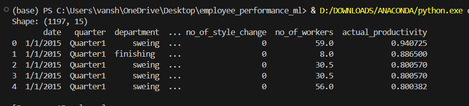
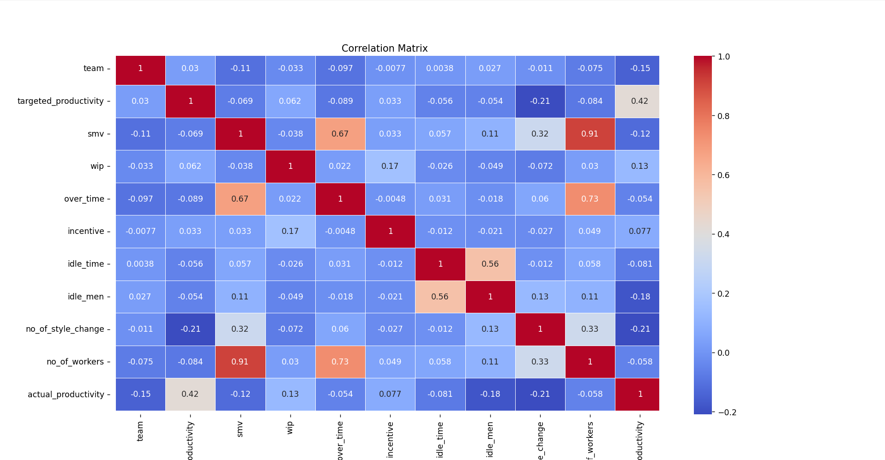
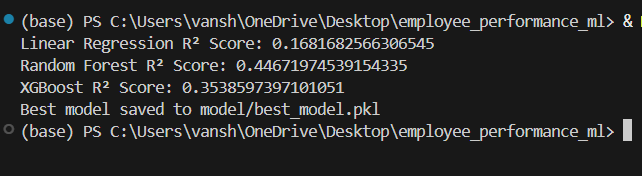
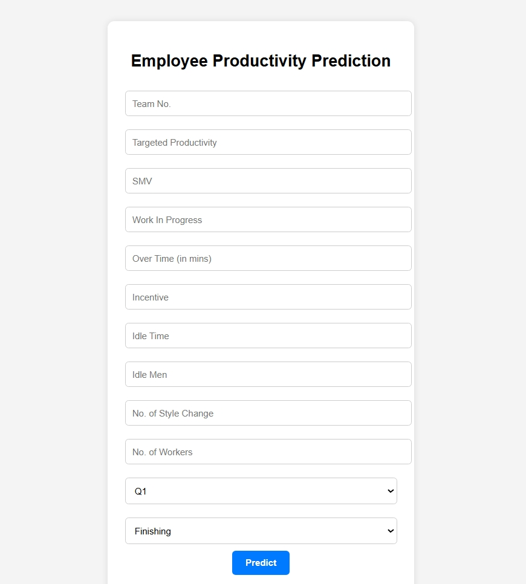
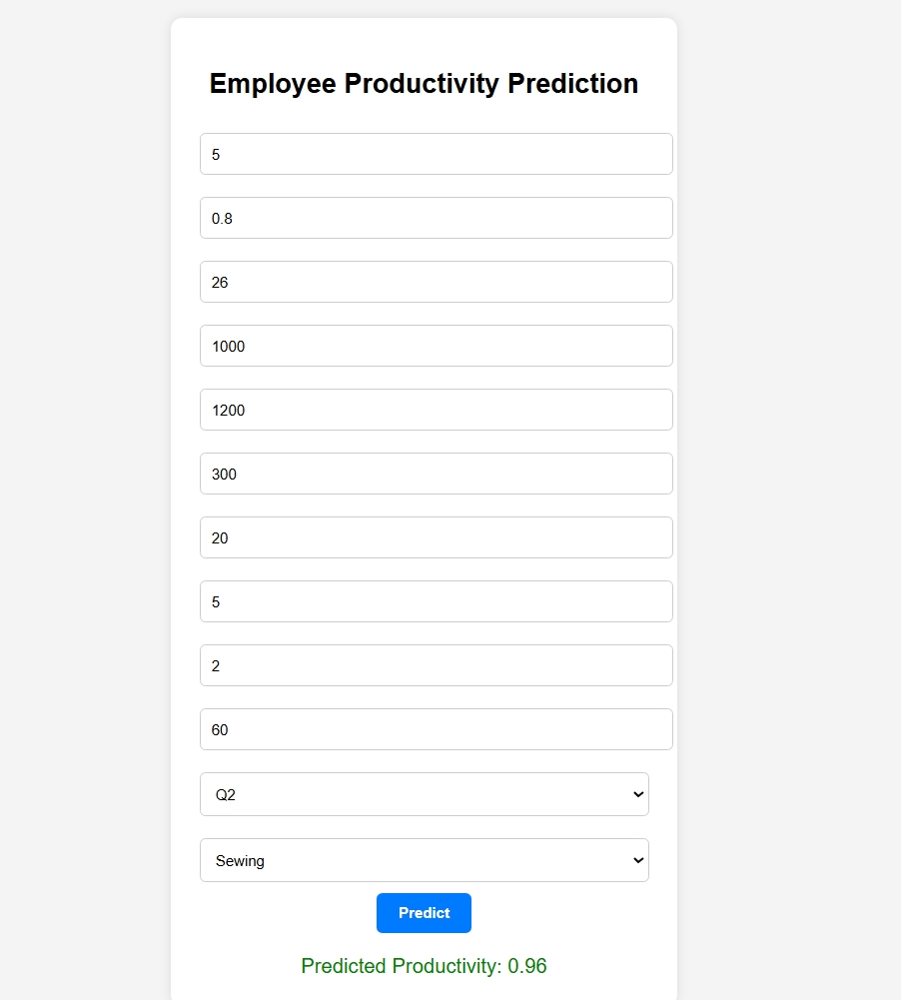

# 🧠 Employee Performance Prediction using Machine Learning

A machine learning based web application that predicts the productivity of employees based on various work-related factors like overtime, idle time, department, team structure, and more.

> 📊 Built using **Linear Regression**, **Random Forest**, and **XGBoost**  
> 🌐 **Frontend:** Flask-based web app for real-time predictions

---

## 📁 Project Folder Structure

```
employee_performance_ml/
├── model/               # Trained model & feature columns
├── templates/           # Flask HTML templates
├── static/              # (Optional) CSS or images
├── dataset/             # CSV input dataset
├── assets/              # Screenshots used in README
├── main.py              # Flask app entry point
├── preprocessing.py     # Data cleaning + transformation
├── visualization.py     # Exploratory Data Analysis
├── model_building.py    # Model training + saving
├── test_predict.py      # Manual testing script
├── requirements.txt     # Dependency list
└── README.md            # You're here 😎
```

---

## 🧠 Problem Statement

This system predicts employee productivity based on historical workplace data.  
Helps businesses to:
- 📉 Identify underperformance trends  
- 🧑‍💼 Support management in training/resource allocation  
- 🔁 Retain top talent using early performance signals  

---

## 📦 Dataset Info

- 📍 **Source:** [Kaggle - Garment Employee Productivity](https://www.kaggle.com/datasets/utkarshsarbahi/productivity-prediction-of-garment-employees)  
- 👥 1197 Rows × 15 Columns  
- 📄 Format: `.csv` (CSV)

### 📸 Sample Preview:


---

## 🔍 Exploratory Data Analysis

Performed:
- ✅ Null check + Imputation (`wip` column)
- 🏷️ Label encoding for categorical fields (Quarter, Department)
- 📊 Correlation + stats visualizations

### 📸 Correlation Matrix:


---

## 🧪 Model Building

Used 3 ML algorithms:
- 📉 Linear Regression  
- 🌲 Random Forest ✅ *(Best Performing)*  
- 🚀 XGBoost  

### 📊 R² Score Comparison:


**🏆 Best Model:** Random Forest (R² ≈ 0.46)

---

## 🌐 Web Application (Flask)

### 🔧 Features:
- 📝 Input employee data via web form  
- 🔮 Predict productivity instantly  
- 🧠 Uses trained Random Forest model behind the scenes  

### 📸 Web Interface:

#### Homepage:


#### Prediction Output:


---

## ▶️ How to Run Locally

```bash
# 1️⃣ Clone Repo
git clone https://github.com/vanstyagi/employee_performance_ml.git
cd employee_performance_ml

# 2️⃣ Install Dependencies
pip install -r requirements.txt

# 3️⃣ Run the App
python main.py
```

---

## 🤝 Contributors

- 🔥 **Vansh** — ML Dev, EDA, Flask Integration  

---

## 📌 Learnings

- 🧠 Complete ML pipeline: Preprocessing → Model → Deploy  
- 📊 Real-world dataset + exploratory data analysis  
- 🌐 Building & connecting backend ML to frontend Flask UI  
- ⚙️ Hands-on end-to-end deployment experience

---

> 🚀 _“Turning raw employee data into actionable productivity insights — fully automated."_  
